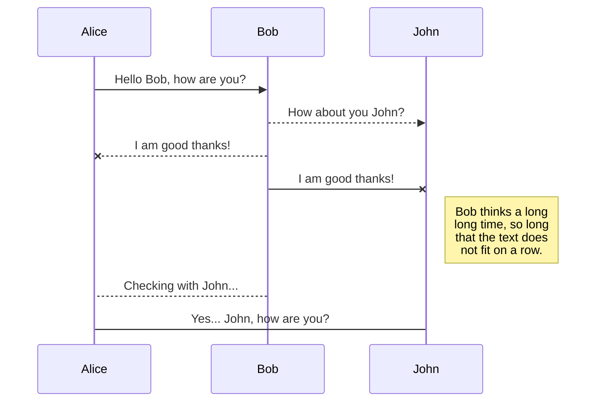
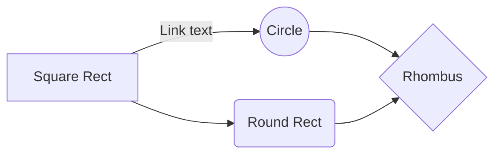

# Projeto de SRJ - Card Wars - Arthur Santos a22503968 

Este relatório vai servir como um documentario do processo de criação do jogo, focando-se principalmente na parte da rede do jogo.

# Sobre o jogo

O jogo é bastante inspirado no jogo "Cards Wars" lançado pela Cartoon Network, lançado em 2014. O jogo foi retirado das lojas em dezembro de 2019. 

  

## Design

O design do jogo é simples e consiste em:
- 2 jogadores um contra o outro.
- Cada jogador inicia com:
	- 20 HP
	- 4 cartas na mão
	- 4 cartas no baralho
	- 2 Mana
- Cada jogador possue 4 terrenos
	- Ao selecionar uma carta e um terreno, o jogador coloca a carta no terreno
	- Cada terreno apenas pode ter 1 unidade
- Cada carta custa X de mana
	- Uma carta pode custar entre 1 à 3 de mana
	- Cada carta possue os seguintes atributos:
		- HP
		- Ataque
		- Custo
		- Efeito especial
- O jogor funciona por Rounds e Turnos:
	- Um Round consiste em 1 turno para cada jogador em um ciclo de:
		- Turno Player 1 -> Turno Player 2 -> Batalha -> Fim do Round
	- O turno inicia com o jogador 1
	- Durante o seu turno o jogador pode jogar cartas, vizualizar cartas e terminar seu turno
	- Durante o turno do oponente, o jogador pode apenas vizualizar suas cartas enquanto espera o turno terminar
	- No fim de ambos turnos, as unidades causam seu respectivo dano a unidade inimiga que estão na mesma linha. (Com exceção de uma carta com efeito especial de atacar todas as unidades)
	- No caso de não existir unidades na linha, a unidade causa dano diretamente ao jogador inimigo, diminuindo seu HP
	- No inicio de um novo Round, ambos jogadores recebm 2 de mana e X cartas até completar 4 cartas na mão.

Aqui segue uma tabela de todas unidades com suas informações.

  

---
# Exempo de coisas - Apagar depois

## SmartyPants

SmartyPants converts ASCII punctuation characters into "smart" typographic punctuation HTML entities. For example:

|                |ASCII                          |HTML                         |
|----------------|-------------------------------|-----------------------------|
|Single backticks|`'Isn't this fun?'`            |'Isn't this fun?'            |
|Quotes          |`"Isn't this fun?"`            |"Isn't this fun?"            |
|Dashes          |`-- is en-dash, --- is em-dash`|-- is en-dash, --- is em-dash|

## KaTeX

You can render LaTeX mathematical expressions using [KaTeX](https://khan.github.io/KaTeX/):

The *Gamma function* satisfying $\Gamma(n) = (n-1)!\quad\forall n\in\mathbb N$ is via the Euler integral

$$
\Gamma(z) = \int_0^\infty t^{z-1}e^{-t}dt\,.
$$

> You can find more information about **LaTeX** mathematical expressions [here](http://meta.math.stackexchange.com/questions/5020/mathjax-basic-tutorial-and-quick-reference).

## UML diagrams

You can render UML diagrams using [Mermaid](https://mermaidjs.github.io/). For example, this will produce a sequence diagram:

And this will produce a flow chart:

